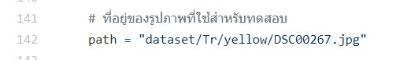
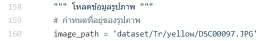

# การรู้จำภาพใบอ้อย 🍀

## ชื่อกลุ่ม: Imagine Salmon 🐠
## รายชื่อสมาชิก
1. นายคุณากร โฆสิตสกุล (61070020)
2. นายชนินทร์ ผลโพธิ์   (61070035)
3. นายธัชพันธุ์ อภิวิชญ์ชลชาติ (61070085)
4. นายอศลย์ อุฒาธรรม (61070262)

<h2> Project 2: Handcraft_base ✋🤚 </h2>

### วิธีการรัน Code 🏃‍♀️🏃‍♂
```python
python handcraft_based.py
```
โดยจะมีการเรียกใช้ฟังก์ชัน 2 ฟังก์ชัน
1. ฟังก์ชัน train()
เมื่อรันเสร็จจะได้  ``` knn_model.joblib ``` ออกมาซึ่งก็คือแบบจำลองนั่นเอง

2. ฟังก์ชัน test()
เมื่อรันเสร็จจะมีการแสดงผลลัพธ์จากการทำนายของแบบจำลองว่าตรงกับข้อมูลชุดทดสอบหรือไม่
### วิธีการเปลี่ยนรูป dataset 📷

ให้แก้ค่าที่ตัวแปร path ในบรรทัดที่ 142 ของไฟล์  handcraft_based.py

### Project 3: Learning_base 🤖🔧🦾🦿

### วิธีการรัน Code 🏃‍♀️🏃‍♂
```python
python learning_based.py
```

โดยจะมีการเรียกใช้ฟังก์ชัน 2 ฟังก์ชัน
1. ฟังก์ชัน train()
เมื่อรันเสร็จจะได้  ``` cnn_model.pt ``` ออกมาซึ่งก็คือแบบจำลองนั่นเอง<br>
พร้อมทั้งแสดงค่าความแม่นยำของแบบจำลอง ```Accuracy: x % ```

2. ฟังก์ชัน test()
เมื่อรันเสร็จจะมีการแสดงผลลัพธ์จากการทำนายของแบบจำลองว่าตรงกับข้อมูลชุดทดสอบหรือไม่
พร้อมทั้งแสดงค่าการทำนาย ```Prediction: xx yy zz ```
### วิธีการเปลี่ยนรูป dataset 📷

ให้แก้ค่าที่ตัวแปร image_path ในบรรทัดที่ 160 ของไฟล์  learning_based.py 
